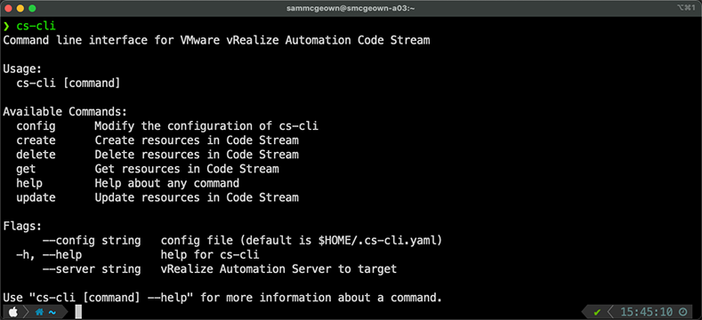

# Code Stream CLI (cs-cli)

 [](https://goreportcard.com/report/github.com/vmware/code-stream-cli)  


The Code Stream CLI is a command line tool written in Go to interact with the vRealize Automation Code Stream APIs. It is written to help automate Code Stream and provide a simple way to migrate content between Code Stream instances and projects.
* Import and Export Code Stream artefacts such as Pipelines, Variables, Endpoints
* Perform CRUD operations on Code Stream artefacts such as Pipelines, Variables, Endpoints
* Trigger Executions of Pipelines



Currently implemented commands:
* [Configuration](#Configuration)
* [Pipelines](#Working-with-Pipelines)
* [Variables](#Working-with-Variables)
* [Executions](#Working-with-Executions)
* [Endpoints](#Working-with-Endpoints)
* [Custom Integrations](#Working-with-Custom-Integrations)

## Installation

There are a few ways you can run `cs-cli` - install with [homebrew](https://brew.sh), download a pre-compiled binary, run the Docker container image, or build from Go source.

### Install using homebrew
MacOs and Linux users can install using homebrew
1) `brew tap sammcgeown/cs-cli`
2) `brew install cs-cli`

### Install the pre-compiled binary
1) Download the gzipped tar package from the [releases](https://github.com/vmware/code-stream-cli/releases/) page.
2) Extract the cs-cli binary, license and readme files
3) Move the cs-cli binary into the PATH for your OS

### Run the Docker image
1) Export environment variables (see below) for your repository
2) Pull the image `docker pull sammcgeown/cs-cli`
3) Run the container passing the environment variables to the image
`docker run -e CS_SERVER="$CS_SERVER" -e CS_USERNAME="$CS_USERNAME" -e CS_PASSWORD="$CS_PASSWORD" -e CS_DOMAIN="$CS_DOMAIN" sammcgeown/cs-cli get variable`


### Build from source
1) Clone the respository
2) Download the repository
3) Run `go install cs-cli` from the respository root


## Configuration

The configuration file stores the targets (vRA servers and credentials) that the CLI will use. By default cs-cli will use `$HOME/.cs-cli.yaml` as the config file. You can override this using the `--config` flag. The configuration file should be secured using file-level permissions to protect your credentials. 

```bash
# Use the default configuration file - $HOME/.cs-cli.yaml
cs-cli get variable
# Specify the configuration file
cs-cli --config /path/to/config.yaml get pipeline
```

Alternatively, you can use ENVIRONMENT variables to configure the CLI
```bash
CS_SERVER="vra8-test-ga.cmbu.local"
CS_USERNAME="test-user"
CS_PASSWORD="VMware1!"
CS_DOMAIN="cmbu.local"

cs-cli get execution
```

### Working with targets

List available targets:
```
cs-cli config get-target
```

Add an target configuration:
```bash
cs-cli config set-target --config test-config.yaml --name my-vra-server --password mypassword --username myuser --domain mydomain.com --server my-vra-server.mydomain.com
# Outputs:
# Creating new target my-vra-server
# Use `cs-cli config use-target --name my-vra-server` to use this target
# {
#   "domain": "mydomain.com",
#   "password": "mypassword",
#   "server": "my-vra-server.mydomain.com",
#   "username": "myuser"
# }
```

```bash
#Set the active target
cs-cli config use-target --name my-vra-server --config test-config.yaml
#View the current active target
cs-cli config current-target --config test-config.yaml
```

## Working with Pipelines

Getting and filtering pipelines
```bash
# List all pipelines
cs-cli get pipeline
# List all pipelines in a project
cs-cli get pipeline --project "Field Demo"
# Get a pipeline by ID
cs-cli get pipeline --id 7a3b41af-0e49-4e3d-999b-6c4c5ec55956
# Get a pipeline by name
cs-cli get pipeline --name "vra-CreateVariable"
```

Exporting pipelines:
```bash
# Export a specific pipeline to current location
cs-cli get pipeline --name "vra-CreateVariable" --export
# Export a specific pipeline to a specific location
cs-cli get pipeline --name "vra-CreateVariable" --export --exportPath /path/to/my/folder
# Export all pipelines
cs-cli get pipeline --export
# Export all pipelines in a project
cs-cli get pipeline --project "Field Demo" --export
```

Importing pipelines:
```bash
# Import a yaml definition
cs-cli create pipeline --importPath /my/yaml-pipeline.yaml
# Import a folder of YAML files (will attempt to import all YAML files in the folder - .yml/.yaml)
cs-cli create pipeline --importPath /Users/sammcgeown/Desktop/cs-cli/pipelines
# Update an existing pipeline
# Note: You cannot change the pipeline name - this
#       will result in a new Pipeline being created
cs-cli update pipeline --importPath /my/updated-pipe.yaml
# Update existing pipelines from folder
cs-cli update pipeline --importPath /Users/sammcgeown/Desktop/cs-cli/pipelines
```


Delete a pipeline:
```bash
# Delete pipeline by ID
cs-cli delete pipeline --id 7a3b41af-0e49-4e3d-999b-6c4c5ec55956
```

## Working with Variables

```bash
# Get all variables
cs-cli get variable
# Get a variable by ID
cs-cli get variable --id 50613ab6-6f25-4976-8b3e-5be7a4bc60eb
# Get a variable by name
cs-cli get variable --name cs-cli
# Create a new variable manually
cs-cli create variable --name cli-demo --project "Field Demo"  --type REGULAR --value "New variable..." --description "Now from the CLI\!"

# Export all variables to variables.yaml
cs-cli get variable --export
# Export all variables to /your/own/filename.yaml
cs-cli get variable --export --exportFile /your/own/filename.yaml

# Create new variables from file
cs-cli create variable --importfile variables.yaml
# Create new variables from file, overwrite the Project
cs-cli create variable --importfile variables.yaml --project TestProject

# Update existing variables from file
cs-cli update variable --importfile variables.yaml
```
*Note that SECRET variables will not export, so if you export your secrets, be sure to add the value data before re-importing them!*

## Working with Executions

```bash
# List all executions
cs-cli get execution
# View an execution by ID
cs-cli get execution --id 9cc5aedc-db48-4c02-a5e4-086de3160dc0
# View executions of a specific pipeline
get execution --name vra-authenticateUser
# View executions by status
cs-cli get execution --status Failed
```

Create a new execution of a pipeline:
```bash
# Get the input form of the pipeline to execute
cs-cli get pipeline --id 7a3b41af-0e49-4e3d-999b-6c4c5ec55956 --form
# Outputs:
# {
#   "vraFQDN": "",
#   "vraUserName": "",
#   "vraUserPassword": ""
# }

# Create a new execution with the input form from above
cs-cli create execution --id 7a3b41af-0e49-4e3d-999b-6c4c5ec55956 --inputs '{
  "vraFQDN": "vra8-test-ga.cmbu.local",
  "vraUserName": "fakeuser",
  "vraUserPassword": "fakeuser"
}' --comments "Executed from cs-cli"
# Outputs
# Execution /codestream/api/executions/9cc5aedc-db48-4c02-a5e4-086de3160dc0 created

# Inspect the new execution
cs-cli get execution --id 9cc5aedc-db48-4c02-a5e4-086de3160dc0
```


## Working with Endpoints
Getting Endpoints
```bash
# Get all endpoints
cs-cli get endpoint
# Get endpoints by project
cs-cli get endpoint --project "Field Demo"
# Get endpoint by Name
cs-cli get endpoint --name "My-Git-Endpoint"
# Get endpoint by Project and Type
cs-cli get endpoint --type "git" --project "Field Demo"
```

Exporting endpoints:
```bash
# Export all endpoints
cs-cli get endpoint --export --exportPath my-endpoints/
# Export endpoint by Name
cs-cli get endpoint --name "My-Git-Endpoint" --export
```

Importing endpoints
```bash
# Create a new endpoint
cs-cli create endpoint --importPath /path/to/my/endpoint.yaml
# Update an existing endpoint
# Note: You cannot change the endpoint name - this
#       will result in a new endpoint being created
cs-cli update endpoint --importPath updated-endpoint.yaml
```

Delete an endpoint
```bash
# Delete endpoint by ID
cs-cli delete endpoint --id 8c36f59a-2fcf-4039-8b48-1026f601a4b0
```
## Working with Custom Integrations

```bash
# Get all custom integrations
cs-cli get customintegration
# Get custom integration by id
cs-cli get customintegration --id c145b52e-c797-49d1-88a5-1d70e7788d03
# Get custom integration by name
cs-cli get customintegration --name base64Encode
```